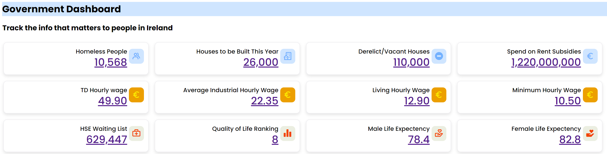
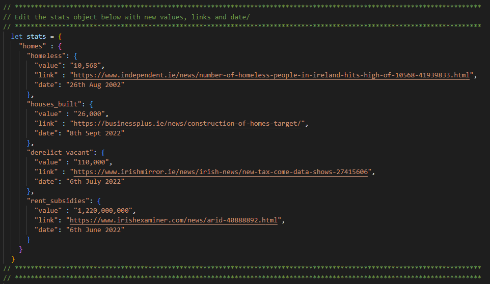

# govDashboard

## Government Dashboard was created to track the data that matters to people in Ireland.

[govdashboard.ie](govdashboard.ie) is a crowdsourced, single source of truth for data points across:
- Housing
- Income
- Health

### How it works

Anyone can make an update to the dashboard when new data becomes available. See "Contributing" below.
All info in the dashboard is backed up with a link from a reputable source.
All sources and history is available in the github repo along with who made the updates.

### Contributing

To update a metric, edit the json at the bottom of index.html by following the guide below or create a PR how you usually do:
- https://docs.github.com/en/repositories/working-with-files/managing-files/editing-files#editing-files-in-another-users-repository

### Thanks
- https://www.codinglabweb.com/2021/05/admin-dashboard-in-html-css.html
- https://boxicons.com/
- https://www.blacknight.com/